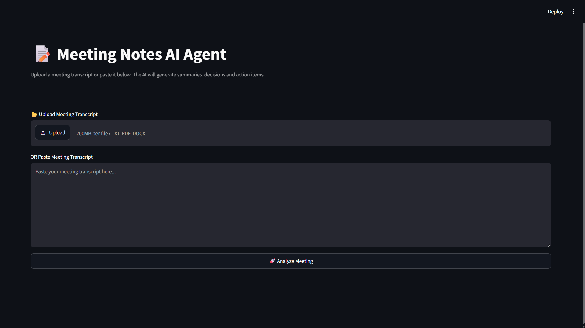
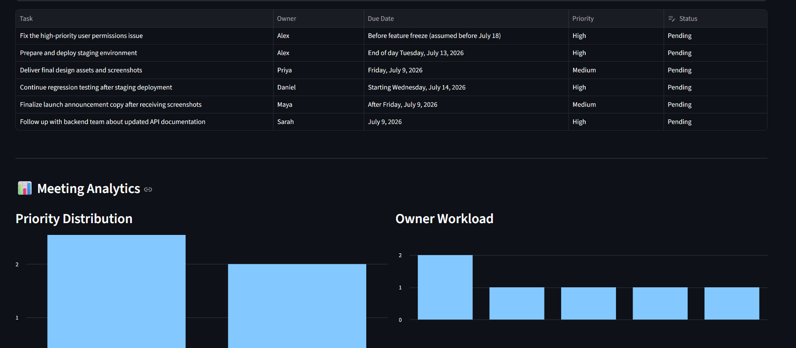

# 📝 AI Meeting Intelligence Agent


An AI-powered **Meeting Intelligence Agent** built using **Python**, **Streamlit**, and **OpenRouter (GPT-4.1 Mini)**.

The application automatically analyzes meeting transcripts, extracts key insights, identifies decisions, action items, risks, recommendations, and generates downloadable reports in multiple formats.

---

# 🌐 Live Demo

**Streamlit App**

https://meetingnotesagent.streamlit.app/

---

# 📂 GitHub Repository

https://github.com/vishal-ladwa-19/meeting_notes_agent.git

---

# ⚡ Quick Start (For Evaluators)

Want to test the project in under a minute?

1. Launch the Streamlit application.
2. Open the `sample_data/meetings/` folder.
3. Upload **project_review.txt**.
4. Click **Analyze Meeting**.
5. Explore:
   - Executive Summary
   - Meeting Type
   - Health Score
   - Decisions
   - Risks
   - Recommendations
   - Action Items
   - Analytics Dashboard
6. Download the generated JSON, CSV, or Markdown report.

---

# 🚀 Features

## 📂 Multi-format Document Support

- TXT
- PDF
- DOCX

---

## 🤖 AI Meeting Intelligence

The application automatically extracts:

- Executive Summary
- Meeting Type
- Meeting Health Score
- Decisions
- Action Items
- Risks
- AI Recommendations
- Follow-up Required

---

## 📊 Interactive Dashboard

- Meeting Statistics
- Health Score
- Decision Count
- Action Item Count
- Analytics Charts
- Priority Distribution
- Owner Workload

---

## 📄 Report Generation

Generate reports in:

- JSON
- CSV
- Markdown

---

## 📁 Analysis History

Automatically stores generated reports locally.

---

## 📝 Logging

Application logs important events for debugging and monitoring.

---

## ✅ Unit Testing

Includes automated tests for:

- Document Parsing
- JSON Validation
- Report Generation
- History Module

---

# ⭐ Project Highlights

- ✅ Multi-format document parsing
- ✅ OpenRouter GPT-4.1 Mini integration
- ✅ Structured AI outputs using JSON
- ✅ Interactive analytics dashboard
- ✅ Markdown report generation
- ✅ JSON & CSV export
- ✅ Logging
- ✅ History tracking
- ✅ Automated unit tests

---

# 📚 Sample Meeting Transcripts

To simplify evaluation, sample meeting transcripts are included.

```
sample_data/
└── meetings/
    ├── project_review.txt
    ├── sprint_planning.txt
    ├── client_meeting.txt
    └── retrospective.txt
```

## Included Examples

| File | Purpose |
|------|---------|
| project_review.txt | Software project review |
| sprint_planning.txt | Sprint planning meeting |
| client_meeting.txt | Client requirements discussion |
| retrospective.txt | Sprint retrospective |

These files can be uploaded directly into the application.

---

# 🏗 Architecture

```
                 User

                  │

                  ▼

      Upload Meeting Transcript

                  │

                  ▼

        Document Parser

       TXT / PDF / DOCX

                  │

                  ▼

         Prompt Builder

                  │

                  ▼

     OpenRouter GPT-4.1 Mini

                  │

                  ▼

      Structured JSON Output

          │        │        │

          ▼        ▼        ▼

     Dashboard  Reports  Analytics

                  │

                  ▼

          History & Logs
```

---

# 🔄 Application Workflow

```
User Upload

↓

Document Parsing

↓

Prompt Generation

↓

OpenRouter AI Analysis

↓

Structured JSON Validation

↓

Dashboard Generation

↓

Analytics

↓

Downloads

↓

History & Logs
```

---

# 📂 Project Structure

```
MeetingNotesAgent/

├── app.py
├── config.py
├── README.md
├── requirements.txt
├── .env.example
├── .gitignore
│
├── assets/
│   └── screenshots/
│
├── logs/
│
├── models/
│   └── schemas.py
│
├── output/
│   └── history/
│
├── prompts/
│   └── system_prompt.txt
│
├── sample_data/
│   └── meetings/
│
├── tests/
│
└── utils/
```

---

# ⚙ Installation

## Clone Repository

```bash
git https://github.com/vishal-ladwa-19/meeting_notes_agent.git

cd meeting_notes_agent
```

---

## Create Virtual Environment

```bash
python -m venv venv
```

Windows

```bash
venv\Scripts\activate
```

Linux / macOS

```bash
source venv/bin/activate
```

---

## Install Dependencies

```bash
pip install -r requirements.txt
```

---

## Configure Environment Variables

Create a `.env` file.

```env
OPENROUTER_API_KEY=your_openrouter_api_key
OPENROUTER_MODEL=openai/gpt-4.1-mini
```

---

## Run Application

```bash
streamlit run app.py
```

---

# 🖥 Usage

1. Upload a TXT, PDF, or DOCX transcript.
2. Or paste meeting text.
3. Click **Analyze Meeting**.
4. Review AI-generated insights.
5. Download reports.

---

# 📈 Example AI Output

The AI generates:

- Executive Summary
- Meeting Type
- Meeting Health Score
- Decisions
- Risks
- Recommendations
- Action Items
- JSON Export
- CSV Export
- Markdown Report

---

# 🧪 Running Tests

```bash
pytest
```

Current Status

```
4 Passed
0 Failed
```

---

# 📊 Technologies Used

- Python 3.11
- Streamlit
- OpenRouter API
- GPT-4.1 Mini
- Pandas
- Pydantic
- PyMuPDF
- python-docx
- python-dotenv
- Pytest

---

# 📸 Screenshots

## Home Page



---

## Dashboard


---

## Analytics



---

## Action Items


---

## Downloads


---

# 💡 Design Decisions

### Why Streamlit?

- Rapid development
- Interactive dashboard
- Easy deployment
- Simple file uploads

### Why OpenRouter?

- Access to multiple LLMs
- Flexible model selection
- Cost-effective API access


---

# 🔮 Future Improvements

- Audio meeting transcription
- Speaker identification
- Calendar integration
- Email report delivery
- Multi-language support
- Database integration
- Team collaboration
- Authentication & user management

---


# 👨‍💻 Developer

**Vishal Ladwa**

Computer Science Engineering Student

AI • Python • Full Stack Development

GitHub:https://github.com/vishal-ladwa-19

LinkedIn: https://linkedin.com/in/vishal-ladwa

---

## ⭐ Acknowledgements

- OpenRouter
- OpenAI SDK
- Streamlit
- PyMuPDF
- Python Community